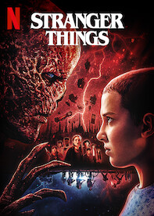

# NetFlix_Clone
## Date: 9/7/2025
## Objective:
To create a modern, responsive navigation bar using CSS Flexbox, mimicking real-world websites like Netflix. This helps reinforce alignment, spacing, and layout structuring using Flexbox properties.

## Tasks:

#### 1. Structure the HTML Layout:
Use a ```<nav>``` tag as the main container.

Add a brand logo/title on the left using a ```<div> or <h1>```.

Add navigation links like Home, Menu, About, Contact, and Login using a ```<ul> with <li> and <a>```.

#### 2. Apply Flexbox for Layout:
Use display: flex on the ```<nav>``` container.

Use justify-content: space-between to align the logo and menu.

Use align-items: center to vertically center both sections.

Style list items with horizontal spacing using gap or margin.

#### 3. Style Like a Real-World Navbar:
Add background color (e.g., dark or gradient like Netflix/Zomato).

Style text with bold fonts, hover effects, and link styling.

Remove default ul and li styles (list-style: none, text-decoration: none).

#### 4. Bonus Enhancements:
Add a hover underline or button effect on links.

Make it responsive using flex-wrap or media queries.

Fix the nav bar to top with position: sticky.
## HTML Code:
```
<!DOCTYPE html>
<html>
<head>
  <title>Netflix - India</title>
  <link rel="stylesheet" href="style.css">
</head>
<body>

  <div class="container">
    

    <nav>
      <ul class="nav-links">
        <li><a href="#">Home</a></li>
        <li><a href="#">Movies</a></li>
        <li><a href="#">TV Shows</a></li>
        <li><a href="#">My List</a></li>
      </ul>
    </nav>

    
  </div>

  <div class="cards">
    <div class="card">
      
      <h3>Squid Game</h3>
    </div>
    <div class="card">
      
      <h3>Stranger Things</h3>
    </div>
    <div class="card">
      
      <h3>When Life Gives You Tangerines</h3>
    </div>
    <div class="card">
      
      <h3>Money Heist</h3>
    </div>
  </div>

</body>
</html>

```
## CSS Code:
```
* {
  margin: 0;
  padding: 0;
  box-sizing: border-box;
}
body {
  background-color: black;
  color: white;
  font-family: 'Roboto', sans-serif;
}

.container {
  margin: 20px;
  display: flex;
  flex-wrap: wrap;
  align-items: center;
  justify-content: space-between;
  padding: 10px;
}

.container > img {
  width: 50px;
  height: 50px;
}

nav {
  display: flex;
  align-items: center;
}

.nav-links {
  list-style: none;
  display: flex;
  gap: 20px;
  padding-left: 20px;
}

.nav-links li {
  list-style: none;
}

.nav-links a {
  text-decoration: none;
  color: white;
  font-weight: bold;
  transition: 0.3s;
}

.nav-links a:hover {
  text-decoration: underline;
}

.profile-pic {
  width: 50px;
  height: 50px;
  border-radius: 50%;
  object-fit: cover;
}

.cards {
  display: flex;
  flex-wrap: wrap;
  gap: 20px;
  margin: 10px 20px;
  justify-content: center;
}

.card {
  background-color: #1a1a1a;
  border-radius: 10px;
  padding: 20px;
  width: 250px;
  height: 400px;
  box-shadow: 0 4px 8px rgba(0, 0, 0, 0.2);
  text-align: center;
}

.card img {
  width: 100%;
  height: 300px;
  object-fit: cover;
  border-radius: 5px;
}

.card h3 {
  margin-top: 10px;
  color: white;
  font-size: 18px;
}

```
## Output:


## Result:
A modern, responsive navigation bar using CSS Flexbox, mimicking real-world websites like Netflix. This helps reinforce alignment, spacing, and layout structuring using Flexbox properties is created successfully.
